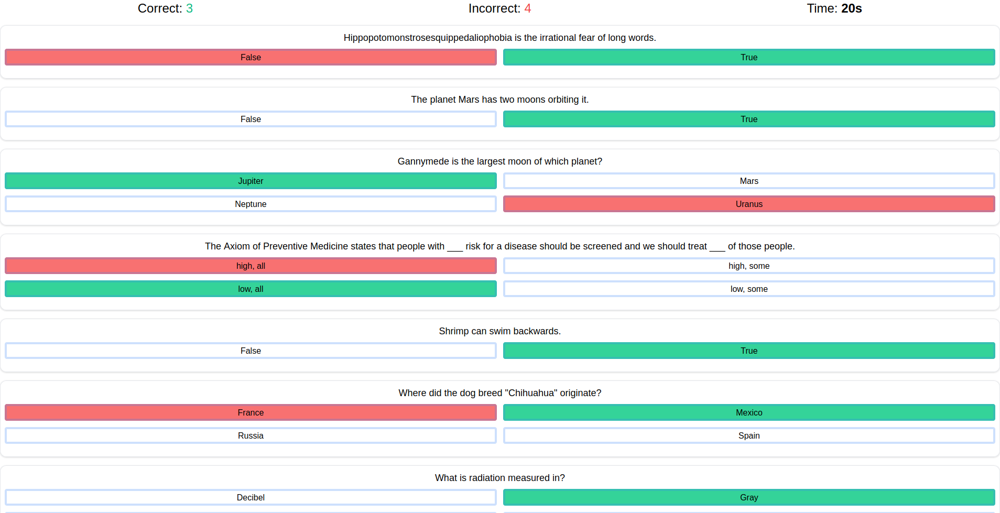

## Proyecto
Proyecto react con el uso de useContext y con diferentes peticiones a una API.

## Github pages
https://jordicher.github.io/react-trivial/

Este proyecto se presenta como un reto en el video de youtube

Construye un portafolio de desarrollo | yo reaccionaré a tu código
[https://www.youtube.com/watch?v=aouDQ8caJYg&t=477s&ab_channel=HolaMundo](videoYoutube)

Esta formado por React, tailwind y como bd utilizo firebase.

Tras descargar una copia del proyecto es necesario instalar los paquetes de los que depende.
Es necesario tener npm instalado en el destino.

### `npm install`

Tras la instalación.
### `npm start`

Runs the app in the development mode.\
Open [http://localhost:3000](http://localhost:3000) to view it in the browser.
